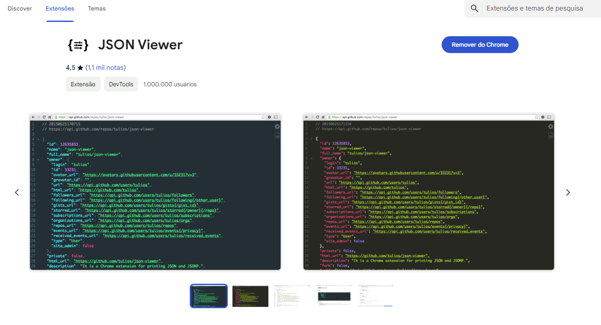
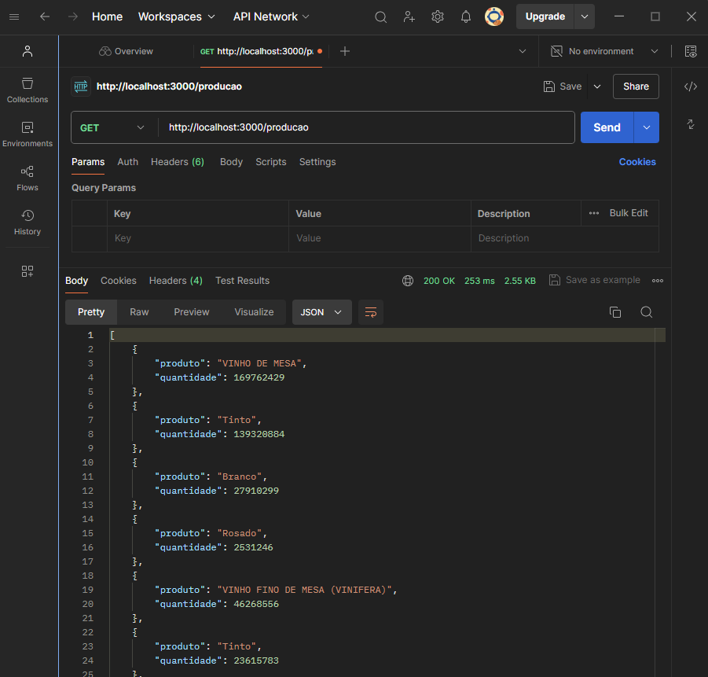
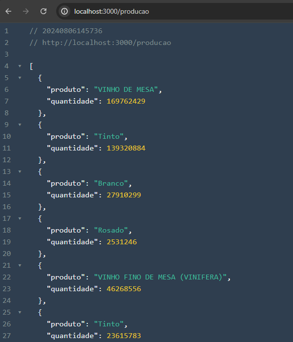

# FastAPI Embrapa Data

Este projeto fornece uma API para acessar dados da Embrapa utilizando o framework FastAPI. A API é capaz de coletar e processar dados de produção, processamento, comercialização, importação e exportação de informações obtidas de páginas HTML da Embrapa.

## Descrição

A API possui vários endpoints que permitem acessar dados em formato JSON, extraídos de tabelas HTML em páginas da Embrapa. A análise HTML é realizada usando a biblioteca BeautifulSoup, e as requisições HTTP são feitas com a biblioteca `requests`.

## Requisitos

- Python 3.7 ou superior
- FastAPI
- BeautifulSoup4
- Requests
- GIT  
- JSON Viewer - Extenção do Chrome - Formatador de arquivos Json (opcional)
- 

## Instalação

1. Clone este repositório dentro da pasta de destino escolhida:

   ```bash
   git clone https://github.com/seu_usuario/seu_repositorio.git
   
2. Abra o IDE, e no terminal, navegue até a pasta que você clonou repositório, e rode o seguinte comando:
   
   ```bash
   pip install -r requirements.txt 
   
3. Rode a aplicação

4. Abra seu nevegador ou cliente Http de sua preferência (Postman / Insomnia) e insira  URL aprensentada no terminal:




